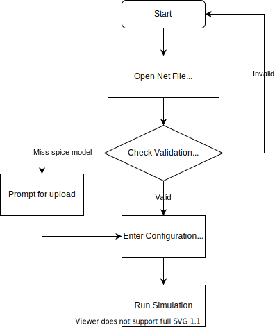

# Tolerance Analysis using Ngspice and Python

## Background
Good circuit design is more than simply calculating the “correct” component values, it is ensuring that the circuit behaves properly when it has been manufactured in large quantities! Part of that evaluation is ensuring that the circuit performs adequately within the bounds of production tolerances.

This simple tool provides easy GUI interface for tolerance analysis of the circuit as well as some other add-on features. It uses

## Requirement
```bash
python>=3.8
pip install numpy scipy pandas matplotlib pyyaml django quantiphy PyQt5
```

## Project Structure
```py
.
├── main.py
├── README.md
├── src
│   ├── config.ui       # Conifugration window ui file
│   ├── __init__.py
│   ├── Logging.py      # Initialize and define log
│   ├── logging.yaml    # Log configuration file
│   ├── main.ui         # Main window ui file
│   ├── MplWidget.py    # Matplotlib canvas configuration file
│   ├── plot.py         # GUI Interface
│   ├── processing.ui   # Processing window ui file
│   ├── read.py         # Read and initialize circuit
│   ├── report          # Generate html5 report, django based project
│   │   ├── htmlreport
│   │   │   ├── admin.py
│   │   │   ├── apps.py
│   │   │   ├── __init__.py
│   │   │   ├── migrations
│   │   │   │   ├── __init__.py
│   │   │   ├── models.py
│   │   │   ├── templates
│   │   │   │   ├── base.html       # Report template
│   │   │   │   ├── inherit.html    # Customized report
│   │   │   │   └── report.html     # Final generated report
│   │   │   ├── tests.py
│   │   │   └── views.py
│   │   ├── manage.py
│   │   ├── report
│   │   │   ├── asgi.py
│   │   │   ├── __init__.py
│   │   │   ├── settings.py
│   │   │   ├── urls.py
│   │   │   └── wsgi.py
│   │   └── static
│   ├── _resultaly.py   # Analyze result
│   ├── _subwindow.py   # Processing and configuration window
│   └── _write.py       # Create circuit control files
└── Workspace
    ├── bin             # ngspice program file, Don't touch
    │   └── ngspice
    ├── clear.py        # Clear user uploaded files
    ├── include         # ngspice include file, Don't touch
    │   └── config.h
    ├── lib             # Put common used spice model in this folder
    │   ├── ngspice     # ngspice lib directory, Don't touch
    │   │   ├── analog.cm
    │   │   ├── digital.cm
    │   │   ├── spice2poly.cm
    │   │   ├── table.cm
    │   │   ├── xtradev.cm
    │   │   └── xtraevt.cm
    │   └── user        # Put your spice model here
    ├── share           # Ngspice, Don't touch
    │   ├── man
    │   │   └── man1
    │   │       ├── cmpp.1
    │   │       └── ngspice.1
    │   └── ngspice
    │       └── scripts
    │           ├── ciderinit
    │           ├── devaxis
    │           ├── devload
    │           ├── setplot
    │           ├── spectrum
    │           └── spinit
```

## Flowchart
